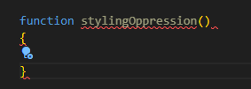
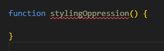

# Coding Standards

Presumably anybody who codes for a living must deal with coding standards. Whether its enforced by a teacher or company or for a group project, coding standards are an
important way to keep everyone on the same page. If you are over here writing like a caveman, and I write like Shakespeare, there is going to be vastly different
comments by the people who have to go back and debug our code. 

What is man on top of triangle? 

You could say Typescript came about because someone said we *need* to have some notation in terms of what types of variables we are working with and passing, etc. Typescript then is a standard for Javascript that says label your code. Okay, fair enough. But to what level should our code be standardized? Down to every little indent? What about the way I format my functions? Hm? Who is anybody to tell me how to do that?!?!

## Basic Standards

Its fair to say their are certain standards that go beyond languages. We almost certainly always want to indent our loops and if-statements and create blocks of code where we can understand what is going in what. At the very basic level these standards represent what the minimum is when it comes to readable code. Some would say its almost common-sensical. Even when you're not coding who is going to read a fat wall of text with no paragraph dividers or anything? So of course the same applies for code. In that sense, having a good sense of spacing and indentation is very important for anyone who expects to get along with others. 

I say these standards are: 

## Language Specific Standards

When it comes to different languages, the obvious differences come from syntax. Language A might format functions like X, language B might format like Y simply because they use different keywords, etc. Sometimes, a language standard might tell you to NOT use this, or NOT use that because it has some type of fault or vulnerability. I remember the *get* method in C was like that, and we had to use *fgets* instead. As such a lot of language specific standards often also represent efficient or secure ways to implement code. These standards are not just for looks and readability, but are necessary for good code. Therefore, understanding the why of some of your coding standards for whatever language you're working on can teach you a thing or two about what's going on behind the scenes so thats pretty neat.

I say these standards are:

## What's Left? 

That about covers most of it. However, there is one last part I have to mention. When I code in Java/Typescript, I am instructed to use ESLint to identify any errors. This also includes some styling standards as well. Ever since I took Program Structure at UH Manoa, I've become fond of putting my curly brackes on their own line. That is:

As you can see, though, I get an error. This is because ESLint wants you to put it as what I assume is the commonly taught way:

Now, for the record, I do believe this changable somewhere in the ESLint preferences or settings. However, I would also say that this really shouldn't even be an error in the first place! Going back to my paragraph on Basic Standards, a lot of languages incoporate the same basic structures. They basically have to. As a result I think there should be some allowance of "artistic expression" in terms of how we format some of our code. I think both ways are valid options and maintain a clean look to them, so dont force your ways upon me I say!

So for minor, unnecessary formating standards I say:

Thank you for reading this PSA.

 
