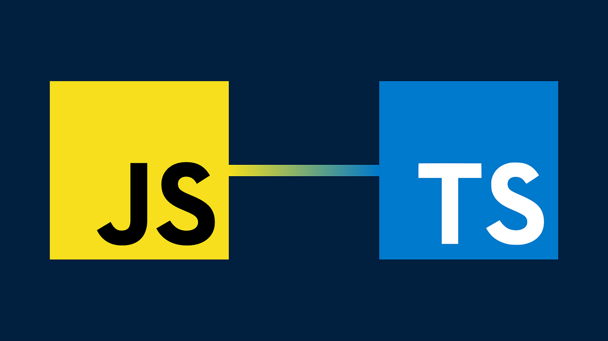

## Javascript

Javascript, according to my limited research and practice, is a very important and widely used language. It is the de facto language for websites that want to add modern UIs and functionality, as opposed to a static webpage
only in HTML (perhaps similar to this essay page). It also has some applications in tandem with other tools to be useful in server-side development as well. Overall it is considered to be a simple and highly versatile languagewith many different applications. 

The introduction of ES6 also added many huge features to keep it that way, such as the creation of classes, separating variables between const and var, and different coding functions such as rests, destructuring, and promises. These features were very new to me so I think its going to take a while to really get familiar and remember it. But still, JavaScript is a language I am very interested in learning since it is so well-known and likely will be very useful in a variety of situations.

## ... and TypeScript

TypeScript on the other hand is another way to create JavaScript code. Redundantly, it is JavaScript that is more tightly typed...hence the name. In learning TypeScript I have to admit I had some more minor headaches trying to wrap my head around and remember some of the formatting. A lot of it, again, centers around TypeScript being more tight than regular old JavaScript. The main draw of having "JavaScript but more tight," is that it creates less confusion when working on larger scale (or maybe if we're just noob coders) projects. Having types more defined within the code allows us to be able to check for errors between how we assign and use variables that wont be caught until runtime in regular JavaScript. Im sure for big codebases where a bunch of people are working on different parts it is very easy to run into errors like that. 

And so, when I say learning a language twice in the title, I say that because all TypeScript does get converted to JavaScript. TypeScript literally is JavaScript, just with a different suit on. In that view, TypeScript exists because of human infallibility. I don't think I'm some Einsteinian genius or anything, but it's funny to think that TypeScript might have been created when developers got more upset with their less than stellar coworkers. 

## Oh, and on athletic software engineering...

Please don't tease for me saying that. 

Anyway, as part of the training regiment for learning TypeScript, I did some 'Workouts of the Day' (WODs), which are just short coding problems (<10-15mins) where you practice your coding "thinking" and know-how. I'd say its useful both in the abstract thinking sense (how to approach and solve problems) and in the general language sense (how to actually write and implement said solution). I really enjoy it. I like that its short, and puts some pressure on you to think as best you can. Its not necessarily about "correctness" in the way that there is a time limit and I am given the solution at the end, but moreso a check on your knowledge. 

In my view, in the case that you don't know how to do it, you do now so you always come away with something. Because of that, I think challenging problems do a great job of really forcing you to think (*insert image of smoke emanating from my skull*) but also giving you an opportunity to see where you were wrong in your thinking all within less than the time of a normal lecture period. 

## Takeaways

Overall, I am excited to learn and practice Type/JavaScript because it is so widely used and implemented. I think it is something I could use both in my professional and personal software projects and hope to really get a good grasp of it. Additionally, I think these WODs are also a great way to learn and are effective for training the Gen Z attention spans that will soon conquer us all. 

 
