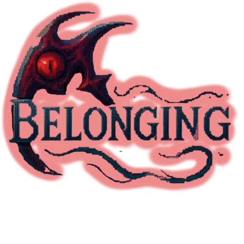

### What is Belonging?
Belonging is a 2D platformer RPG game developed in Unity by myself and a group for our Video Game Development class. 

It features a top-down open world where you explore the village and nearby forests as well as talk to and interact with other NPCs and objects. We've also implemented
some puzzles as well. Most of our narrative is run through this part.

It also has multiple 2D platformer levels, where most of the action and gameplay is supposed to come from. You can switch between weapons and fight a variety of enemies,
including two bosses.

### My Role
I mainly helped implement the 2D platformer part. That included designing the inventory system, level design, some part of the enemy AI, and other minor environmental features.

The game is not yet finished. But here is a little trailer to see our progress.



You can also see more at our game site here:
Source: <a href="https:https://just-making-kool-renders.github.io"><i class="large github icon "></i>Belonging Main Site</a>

