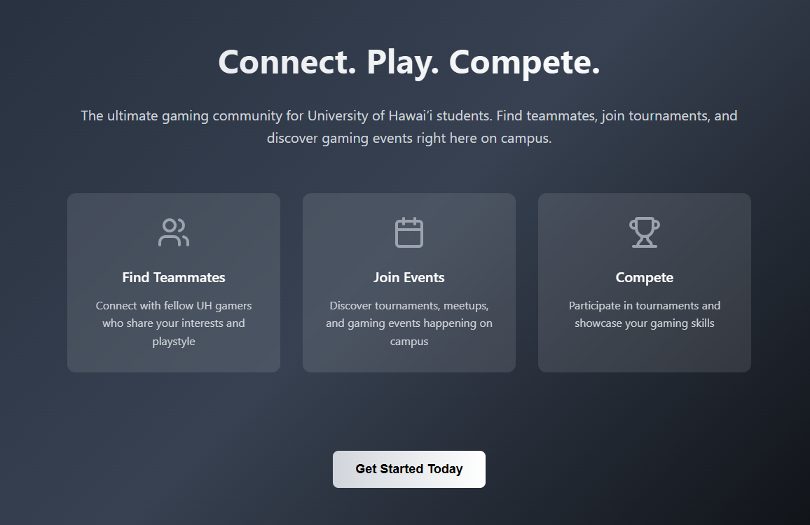
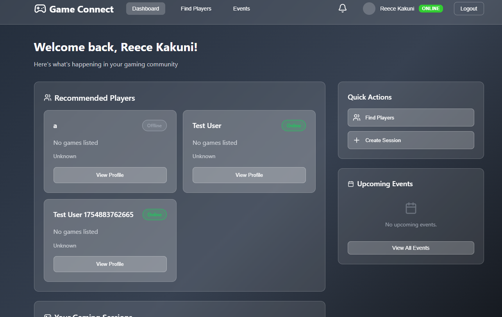

Gamers Connect is a site that allows users to find other gamers and create sessions to play with them all online. It offers a way to play with friends you already know, or meet new ones through public sessions. Users can set play times in advance, and allow sessions to fill up before it happens. It supports most of the popular games today, and is simple to use.

Above is the dashboard where users can see their friends online, make a session, and see upcoming ones as well. Additionally there are tabs to search for players or sessions so they can try and play with new users too.

See more here: https://uh-gamers-connect.vercel.app/